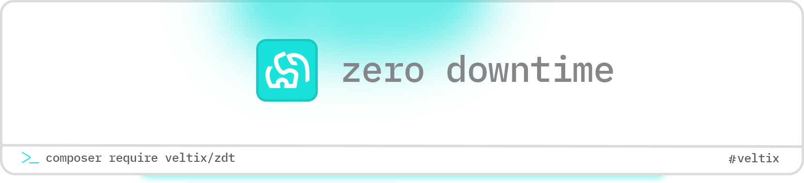

<p align="center">
  <picture>
    <source media="(prefers-color-scheme: dark)" srcset="zdt-banner-dark.png">
    <source media="(prefers-color-scheme: light)" srcset="zdt-banner-light.png">
    
  </picture>
</p>

<p align="center">
  <a href="https://github.com/veltix/zdt/actions"></a>
  <a href="https://packagist.org/packages/veltix/zdt"></a>
  <a href="https://packagist.org/packages/veltix/zdt"></a>
  <a href="LICENSE.md"></a>
</p>

<p align="center">
  <strong>Deploy your applications with zero downtime.</strong><br>
  Simple, secure, and reliable deployments using atomic symlink switching.
</p>

---

## What is ZDT?

ZDT (Zero Downtime Tool) is a deployment tool that ensures your application stays online during deployments. It deploys to a new directory, runs all setup tasks, then switches traffic atomically. If anything fails, it automatically rolls back.

**Perfect for:** PHP/Laravel applications, Node.js apps, static sites, or any web application.

## How It Works

```
1. Connect to server via SSH
2. Clone code to new release directory (releases/20231202143000/)
3. Install dependencies & run hooks
4. Run database migrations
5. Switch symlink atomically (current → new release)
6. Health check & cleanup old releases
7. Auto-rollback if anything fails
```

**Key Features:**
- ✅ Zero downtime - atomic symlink switching
- ✅ Automatic rollbacks on failure
- ✅ Health checks - validate deployments succeed
- ✅ Deployment locks - prevent concurrent deployments
- ✅ Database backups - automated pre-migration backups
- ✅ Notifications - Slack, Discord webhooks
- ✅ Release history & instant rollback
- ✅ Deployment hooks for custom tasks
- ✅ Works with GitHub Actions, GitLab CI, or locally

## Installation

```bash
composer global require veltix/zdt
```

Or install in your CI/CD workflow (no global install needed).

## Quick Start

### 1. Setup GitHub Secrets

Go to your repository **Settings → Secrets → Actions** and add:

| Secret | Example | Description |
|--------|---------|-------------|
| `DEPLOY_HOST` | `your-server.com` | Server hostname or IP |
| `DEPLOY_USERNAME` | `deploy` | SSH username |
| `DEPLOY_SSH_KEY` | `-----BEGIN OPENSSH...` | Private SSH key |
| `DEPLOY_PATH` | `/var/www/myapp` | Deployment path on server |

### 2. Create Workflow

Create `.github/workflows/deploy.yml`:

```yaml
name: Deploy

on:
  push:
    branches: [main]

jobs:
  deploy:
    runs-on: ubuntu-latest
    steps:
      - uses: actions/checkout@v4

      - uses: shivammathur/setup-php@v2
        with:
          php-version: '8.2'

      - name: Deploy
        env:
          DEPLOY_HOST: ${{ secrets.DEPLOY_HOST }}
          DEPLOY_USERNAME: ${{ secrets.DEPLOY_USERNAME }}
          DEPLOY_KEY_PATH: ${{ secrets.DEPLOY_SSH_KEY }}
          DEPLOY_REPO_URL: https://github.com/${{ github.repository }}.git
          DEPLOY_PATH: ${{ secrets.DEPLOY_PATH }}
          DEPLOY_BRANCH: ${{ github.ref_name }}
        run: |
          composer global require veltix/zdt
          echo "$DEPLOY_KEY_PATH" > ~/.ssh/deploy_key
          chmod 600 ~/.ssh/deploy_key
          export DEPLOY_KEY_PATH=~/.ssh/deploy_key
          zdt deploy
```

### 3. Push & Deploy

```bash
git push origin main
```

Your app deploys automatically with zero downtime! 🚀

---

## Configuration Methods

ZDT supports **3 flexible configuration approaches**. Choose what works best for you:

### Method 1: GitHub Actions (Simplest)

Perfect for CI/CD pipelines. Configuration lives in GitHub Secrets.

**Pros:** 
- ✅ No config files
- ✅ Secure secrets
- ✅ Quick setup

**Cons:** 
- ❌ GitHub-only 
- ❌ Can't deploy locally

```yaml
# .github/workflows/deploy.yml
- name: Deploy
  env:
    DEPLOY_HOST: ${{ secrets.DEPLOY_HOST }}
    DEPLOY_USERNAME: ${{ secrets.DEPLOY_USERNAME }}
    DEPLOY_KEY_PATH: ${{ secrets.DEPLOY_SSH_KEY }}
    DEPLOY_REPO_URL: https://github.com/${{ github.repository }}.git
    DEPLOY_PATH: ${{ secrets.DEPLOY_PATH }}
  run: |
    composer global require veltix/zdt
    zdt deploy
```

**[See full example →](examples/deploy.yml)**

---

### Method 2: Server Config (Recommended)

Store configuration in `.env.deployment` file on your server. Perfect for teams and multiple environments.

**Pros:** 
- ✅ Deploy from anywhere
- ✅ Server-specific config
- ✅ No project files needed

**Cons:** 
- ❌ Need server access
- ❌ Manual setup per server

**Setup:**

1. **Create config on server:**
   ```bash
   ssh user@your-server.com
   nano /var/www/myapp/shared/.env.deployment
   ```

2. **Add your settings:**
   ```env
   DEPLOY_HOST=your-server.com
   DEPLOY_USERNAME=deploy
   DEPLOY_KEY_PATH=~/.ssh/id_rsa
   DEPLOY_REPO_URL=https://github.com/you/repo.git
   DEPLOY_PATH=/var/www/myapp
   DEPLOY_BRANCH=main
   ```

3. **Deploy (simple!):**
   ```yaml
   - run: zdt deploy  # That's it! No env vars needed
   ```

**[See template →](examples/.env.deployment.example)**

---

### Method 3: Project Config (Flexible)

Commit a `deploy.php` file to your repository. Great for complex logic or team workflows.

**Pros:** 
- ✅ Versioned with code 
- ✅ Custom logic 
- ✅ Team-friendly

**Cons:**
- ❌ One more file to manage

**Setup:**

1. **Add `deploy.php` to your project:**
   ```bash
   curl -o deploy.php https://raw.githubusercontent.com/veltix/zdt/main/examples/deploy-project-env.php
   git add deploy.php
   git commit -m "Add deployment config"
   ```

2. **Deploy:**
   ```yaml
   - run: zdt deploy  # Uses deploy.php from your repo
   ```

**[See example →](examples/deploy-project-env.php)**

---

### Hybrid Approach (Best of All!)

**Use multiple methods together!** Priority order:

1. **Environment variables** (highest - CI/CD overrides)
2. **Server's `.env.deployment`** (persists across deployments)
3. **Project's `deploy.php`** (versioned with code)

Example: Use `.env.deployment` on server for defaults, override with GitHub secrets for staging:

```yaml
env:
  DEPLOY_BRANCH: staging  # Override branch for staging deploy
run: zdt deploy
```

---

## Commands

```bash
# Deploy application
zdt deploy

# Rollback to previous release
zdt rollback

# Rollback to specific release
zdt rollback --release=20231202-143000

# List all releases
zdt list-releases

# Clean up old releases (keep 3 most recent)
zdt cleanup --keep=3

# Initialize deployment structure on server
zdt deploy:init
```

---

## Advanced Features

### 🏥 Health Checks

Validate your deployment succeeded with HTTP health checks. ZDT can ping a URL after activation and automatically rollback if it fails.

**Configuration:**

```yaml
env:
  DEPLOY_HEALTH_CHECK_ENABLED: true
  DEPLOY_HEALTH_CHECK_URL: https://yourapp.com/health
  DEPLOY_HEALTH_CHECK_TIMEOUT: 30  # seconds
```

**How it works:**
1. Deploy completes and symlink switches
2. Health check pings your URL
3. If response is not 2xx, automatic rollback
4. If successful, continues with cleanup

**Example Health Check Endpoint** (Laravel):
```php
// routes/web.php
Route::get('/health', function () {
    return response()->json(['status' => 'ok'], 200);
});
```

---

### 🔒 Deployment Locks

Prevent concurrent deployments that could corrupt your releases. ZDT automatically creates a lock file during deployment.

**Features:**
- Lock file at `{DEPLOY_PATH}/.deploy.lock`
- Prevents multiple simultaneous deployments
- Auto-removes stale locks (1 hour timeout)
- Always released even if deployment fails

**No configuration needed** - works automatically!

If a deployment is already running:
```
✗ Deployment failed: Another deployment is in progress.
  Lock file: /var/www/app/.deploy.lock (age: 120s, timeout in 3480s)
```

---

### 💾 Database Backups

Automatically backup your database before running migrations. Backups are compressed and stored with each release for easy restoration.

**Configuration:**

```yaml
env:
  DEPLOY_DB_BACKUP_ENABLED: true
  DEPLOY_DB_CONNECTION: mysql        # or: pgsql, postgres, mariadb
  DEPLOY_DB_HOST: localhost
  DEPLOY_DB_PORT: 3306
  DEPLOY_DB_DATABASE: myapp
  DEPLOY_DB_USERNAME: dbuser
  DEPLOY_DB_PASSWORD: ${{ secrets.DB_PASSWORD }}
  DEPLOY_DB_KEEP_BACKUPS: 5          # Keep last 5 backups
```

**Supported Databases:**
- MySQL / MariaDB
- PostgreSQL

**Backup Location:**
```
/var/www/app/
├── backups/
│   ├── db-backup-20231215-143000.sql.gz
│   ├── db-backup-20231215-120000.sql.gz
│   └── db-backup-20231215-100000.sql.gz
```

**Manual Restore:**
```bash
# On server
cd /var/www/app/backups
gunzip db-backup-20231215-143000.sql.gz
mysql -u dbuser -p myapp < db-backup-20231215-143000.sql
```

---

### 📢 Deployment Notifications

Get notified about deployments via webhooks (Slack, Discord, etc.).

**Configuration:**

```yaml
env:
  DEPLOY_NOTIFICATION_WEBHOOK: ${{ secrets.SLACK_WEBHOOK }}
```

**Notifications sent for:**
- 🚀 Deployment started
- ✅ Deployment successful
- ❌ Deployment failed
- ⏪ Deployment rolled back

**Slack Webhook Setup:**
1. Go to https://api.slack.com/apps
2. Create app → Incoming Webhooks → Add to Workspace
3. Copy webhook URL to GitHub Secrets
4. Done!

**Discord Webhook Setup:**
1. Server Settings → Integrations → Webhooks
2. Create Webhook → Copy URL
3. Add `/slack` to the end of URL
4. Add to GitHub Secrets

**Example Slack Message:**
```
🚀 Deployment started
Release: 20231215-143000
Server: prod.example.com
Branch: main
```

---

## Deployment Hooks

Run custom commands at different stages of deployment:

```yaml
env:
  # After cloning repository
  DEPLOY_HOOKS_AFTER_CLONE: |
    composer install --no-dev --optimize-autoloader
    npm ci --production
    npm run build

  # Before activating new release
  DEPLOY_HOOKS_BEFORE_ACTIVATE: |
    php artisan migrate --force
    php artisan config:cache
    php artisan route:cache

  # After successful deployment
  DEPLOY_HOOKS_AFTER_ACTIVATE: |
    php artisan queue:restart
    php artisan cache:clear
```

**Available hooks:**
- `DEPLOY_HOOKS_BEFORE_CLONE` - Before cloning
- `DEPLOY_HOOKS_AFTER_CLONE` - After cloning, before activation
- `DEPLOY_HOOKS_BEFORE_ACTIVATE` - Before switching symlink
- `DEPLOY_HOOKS_AFTER_ACTIVATE` - After successful deployment
- `DEPLOY_HOOKS_AFTER_ROLLBACK` - After rollback

**Note:** Hooks that fail will abort deployment and trigger automatic rollback.

---

## Server Directory Structure

```
/var/www/myapp/
├── current → releases/20231202150000/    # Symlink to active release
├── releases/
│   ├── 20231202143000/                   # Previous releases
│   ├── 20231202145000/
│   └── 20231202150000/                   # Current active
└── shared/
    ├── .env                               # Laravel env file
    ├── .env.deployment                    # ZDT config (optional)
    └── storage/                           # Shared storage
```

**What's shared across releases:**
- `.env` file (copied to each release)
- `storage/` directory (symlinked)
- Custom paths you configure

---

## Configuration Reference

### Environment Variables

| Variable | Required | Default | Description |
|----------|----------|---------|-------------|
| `DEPLOY_HOST` | ✅ Yes | - | Server hostname |
| `DEPLOY_USERNAME` | ✅ Yes | - | SSH username |
| `DEPLOY_REPO_URL` | ✅ Yes | - | Git repository URL |
| `DEPLOY_PATH` | ✅ Yes | - | Deployment path |
| `DEPLOY_KEY_PATH` | No | `~/.ssh/id_rsa` | SSH private key path |
| `DEPLOY_BRANCH` | No | `main` | Git branch to deploy |
| `DEPLOY_PORT` | No | `22` | SSH port |
| `DEPLOY_TIMEOUT` | No | `300` | SSH timeout (seconds) |
| `DEPLOY_KEEP_RELEASES` | No | `5` | Number of releases to keep |

### For Laravel Applications

**Add these hooks for optimal Laravel deployments:**

```yaml
DEPLOY_HOOKS_AFTER_CLONE: |
  composer install --no-dev --optimize-autoloader

DEPLOY_HOOKS_BEFORE_ACTIVATE: |
  php artisan migrate --force
  php artisan config:cache
  php artisan route:cache
  php artisan view:cache

DEPLOY_HOOKS_AFTER_ACTIVATE: |
  php artisan queue:restart
  php artisan optimize
```

### For Static Sites

```yaml
DEPLOY_HOOKS_AFTER_CLONE: |
  npm i
  npm run build
```

---

## Server Requirements

Your deployment server needs:

- **SSH access** with key-based authentication
- **Git** installed
- **PHP 8.2+** (for PHP applications)
- **Composer** (for PHP dependencies)
- **Node.js & NPM** (for frontend builds)

### Server Setup (One-time)

```bash
# Install dependencies (AlmaLinux/RHEL)
sudo dnf install git

# Or Ubuntu/Debian
sudo apt install git

# Create deployment user
sudo useradd -m -s /bin/bash deploy
sudo mkdir -p /var/www/myapp
sudo chown deploy:deploy /var/www/myapp

# Add SSH key
sudo -u deploy mkdir -p /home/deploy/.ssh
echo "your-public-key" | sudo -u deploy tee /home/deploy/.ssh/authorized_keys
```

---

## Troubleshooting

### Permission Errors

```bash
# Fix storage permissions
sudo chown -R deploy:nginx /var/www/myapp/shared/storage
sudo chmod -R 775 /var/www/myapp/shared/storage
```

### Git Authentication (Private Repos)

For **private repositories**, your server needs access:

```bash
# On your server
ssh-keygen -t ed25519 -C "deploy@server" -f ~/.ssh/github_deploy
cat ~/.ssh/github_deploy.pub
```

Add the public key to: **GitHub → Repo Settings → Deploy Keys**

For **public repositories**, use HTTPS URL (no key needed):
```yaml
DEPLOY_REPO_URL: https://github.com/user/repo.git
```

---

## Examples

- **[Basic deployment](examples/deploy.yml)** - Simple GitHub Actions workflow
- **[Advanced workflow](examples/test-deploy.yml)** - Multiple environments, testing, notifications
- **[Server config](examples/.env.deployment.example)** - .env.deployment template
- **[Project config](examples/deploy-project-env.php)** - deploy.php example

---

## Contributing

Contributions welcome! Please:

1. Fork the repository
2. Create a feature branch
3. Write tests for your changes
4. Run `vendor/bin/pint` for code style
5. Run `php zdt test` to verify tests pass
6. Submit a pull request

---

## Security

Found a security issue? Email **security@veltix.sh** instead of opening an issue.

---

## Credits

Built with ❤️ using [Laravel Zero](https://laravel-zero.com)

## License

MIT License - see [LICENSE.md](LICENSE.md)

---

<p align="center">
  <strong>Deploy with confidence. Deploy with ZDT.</strong>
</p>
